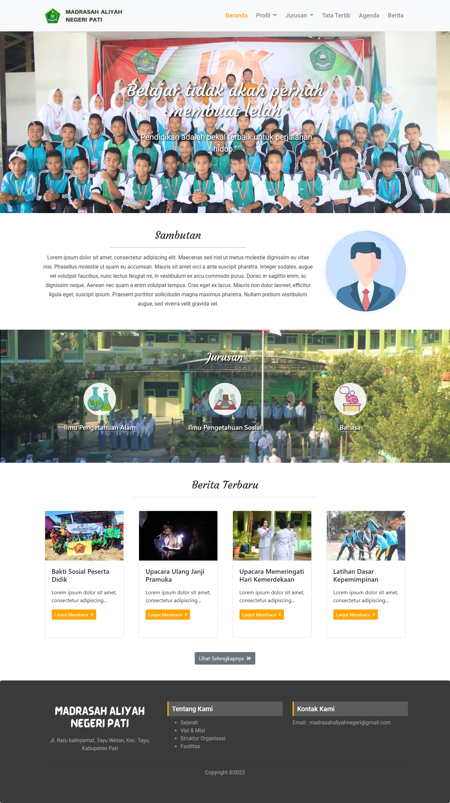
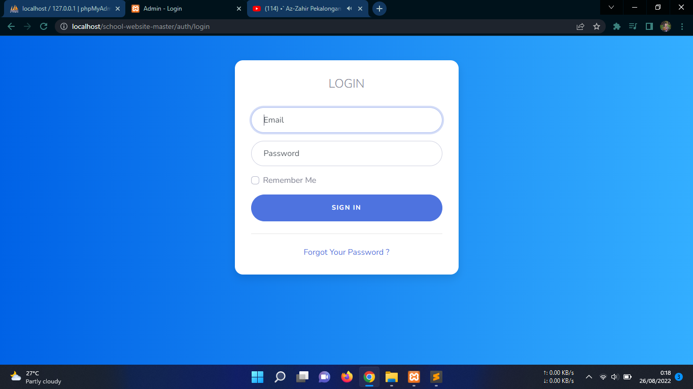
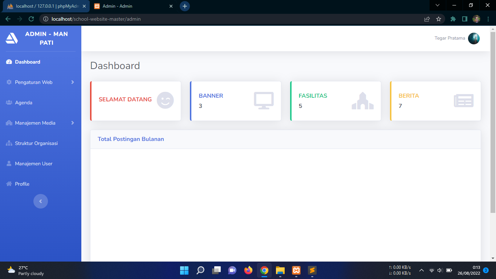
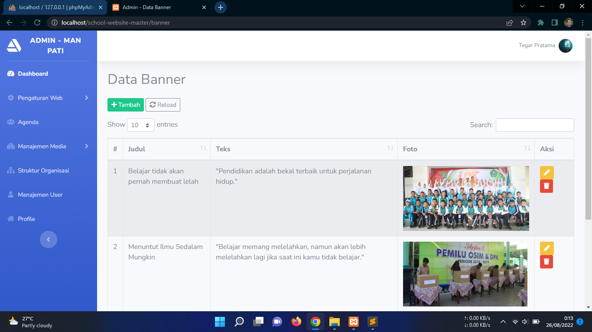

# School Website
Website sekolah dengan menggunakan framework CodeIgniter ini memiliki tampilan yang sederhana dan fitur yang mampu berfungsi dengan baik.

To access admin page, add url /admin. Example http://localhost/school-website-master/admin

## Tampilan Aplikasi

## Admin Account
|    Username    | Password |
|:--------------:|---------:|
| admin@mail.com | admin123 |

Tools:
- Codeiginiter 3
- MySql
- Bootstrap 4
- Jquery
- Datatables
- Summernote
- Sweetalert2
- Codeigniter Ion Auth
